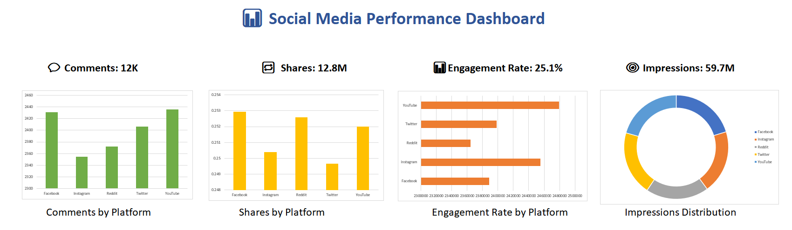

# 📊 Excel Social Media Analysis Dashboard

💼 This project demonstrates my ability to analyze social media performance using Excel and convert raw data into actionable business insights.

---

## 📌 Project Overview

This project analyzes engagement, impressions, shares, and comments across multiple social media platforms.
Interactive dashboards help identify trends, top-performing platforms, and user behavior.

---

## 🎯 Key Business Questions

* Which platform has the highest engagement?
* Which platform drives the most impressions?
* How do shares and comments vary across platforms?

---

## 🛠 Tools Used

* Microsoft Excel
* Pivot Tables
* Data Cleaning
* Dashboard Design

---

## 📊 Dashboard Features

* KPI Cards (Comments, Shares, Impressions, Engagement Rate)
* Platform-wise comparison charts
* Interactive visuals
* Business insights summary

---
## 📷 Dashboard Preview

----

## 📈 Key Insights

* YouTube leads in comments, shares, and impressions
* Facebook shows the highest engagement rate
* Twitter has the lowest engagement
* Instagram performs consistently across metrics

---

## 💡 Business Impact

This dashboard helps businesses:

* Optimize content strategy
* Improve audience engagement
* Make data-driven marketing decisions

---

